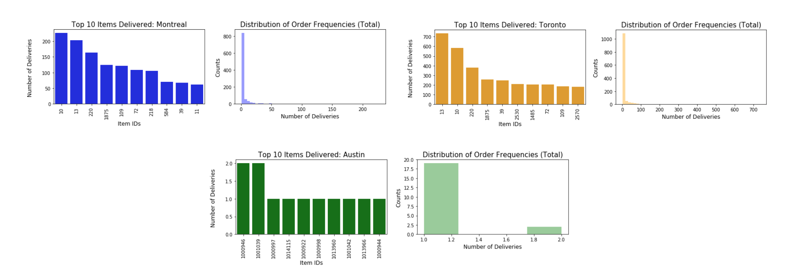

# Catalog Item Clustering for Company X

This was a problem given to me by Company X (undisclosed) to identify clusters of items in the catalog that are similar to each other. Items were first split for clustering between Austin and Montreal-Toronto before association analysis was performed in identifying relationships between patterns of orders. Specifically, similarity matrix between items were constructed based on correlations of how likely items are delivered together in a single order. Dimensional reduction and unsupervised clustering techniques were subsequently applied to perform groupings of items. Being able to cluster items based on purchasing patterns is important not only because it  allows better understanding of how items are purchased together but also how items could be more efficiently organized in storages. Recommendation systems and how combinations of items can be marketed  can also benefit in clustering analysis.

## EDA
There are a total 1788 unique items to cluster across 5236 unique orders. Exploratory data analysis revealed that the the top-10 items delivered and the distribution of number of items delivered were similar between Toronto and Montreal, while Austin had items delivered only  either once or twice. Moreover, there were no overlap in items between Austin and the other two cities, and the clustering of all items together may dilute similarity measurement. Therefore, items only delivered in Austin were split from Toronto/Montreal to perform clustering analysis individually.

## Market Basket Analysis
While the final clustering algorithm was applied on similarity measurements based on Pearson’s correlation, market basket analysis was interesting and provided clear intuition of which items were most likely delivered together:

## Similarity Matrix, Dimensionality Reduction and Clustering  
Similar to the memory based collaborative filtering approach, similarity matrices were constructed using Pearson’s correlation. This was performed on the OrderID to ItemID matrix dataframe, where item-to-item correlations were computed. The dimensions of the correlation matrix used for  unsupervised clustering was large given the number of itemIDs. In order to reduce its dimensional complexity, PCA was performed to extract features that explain for 75% of the variance. Subsequently, k-means and hierarchical clustering were implemented, although the elbow method was unable to identify the optimal number clusters for k-means in Toronto-Montreal items. Hierarchical clustering, on the other hand, provides a structure that is more informative than flat clusters returned by k-means, and dendrograms allow an optimal number of clusters to be selected.

## Results and Discussion
Final clustering results (concatenating results from Austin and Toronto/Montreal) with hierarchical clustering can be found in T2_cluster_results.csv. While understanding of the individual clusters becomes  difficult without a table of what each itemID corresponds to, we do know that items with cluster labels 0 - 3 were found in Austin while 4 - 8 are in Toronto/Montreal. 

## Challenges, Future Directions and KPIs
One of the biggest challenges in this problem was not being able to understand what each cluster represents without any information on what each itemID corresponds to. Additionally, the large number of items that only occur once or twice in the dataset was another hurdle for clustering them with relatively little information.   

Another exciting approach to clustering these items could be through non-negative matrix factorization. This is similar to model-based collaborative filtering and would allow the OrderID to ItemID matrix to be decomposed into two matrices and allow discovery of  latent features underlying the interactions between them. These latent features with the items matrix could subsequently be used for further clustering. Another exciting work that could be done is the identification of relationship between UserIDs and the items they ordered, as mentioned in the previous report. Several KPIs can be used to evaluate the model developed here. One of them is whether these items are still commonly ordered together, and whether this model works well in the different cities.  In particular, it would be interesting to explore whether items that exist in both Montreal and Toronto would show the same relationships they have with other items in the two cities.
